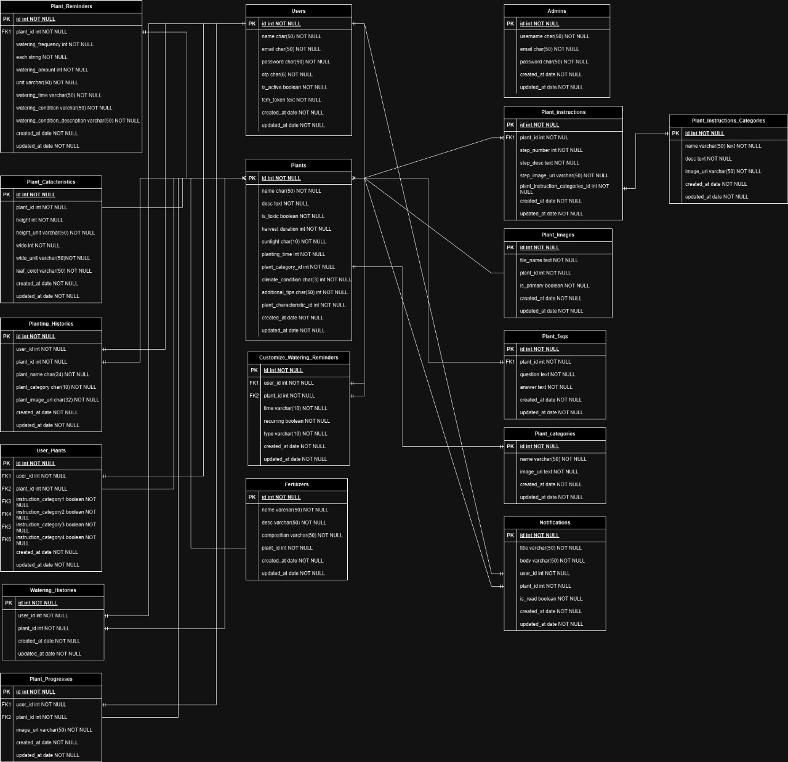

# Plantopia (Agriculture App)

## Kelompok 4 (Agriculture)

**Backend Team:**

- Octaviano Ryan Eka (Leader)
- Farrel Amroe Azhari
- Muhamad Faqih Azhar

## About Project

Plantopia adalah sebuah aplikasi pertanian modern yang dirancang untuk menyederhanakan proses bertani bagi siapa saja, tanpa memerlukan keahlian khusus. Dengan Plantopia, setiap individu dapat merasakan pengalaman bertani yang menyenangkan dan mudah.

## Features

Secara umum Plantopia dilengkapi dengan fitur-fitur berikut ini:

**Panduan Menanam yang Komprehensif:**
Plantopia menyediakan panduan menanam untuk berbagai macam jenis tanaman, mulai dari sayuran, buah-buahan, hingga tanaman hias. Panduan ini mencakup langkah-langkah detail dari persiapan lahan hingga panen, sehingga pengguna dapat mengikuti dengan mudah dan mendapatkan hasil terbaik.

**Reminder Perawatan Tanaman:**
Plantopia dilengkapi dengan fitur pengingat otomatis untuk merawat tanaman. Pengguna akan menerima notifikasi untuk menyiram, memberi pupuk, dan melakukan perawatan lainnya sesuai kebutuhan masing-masing tanaman. Fitur ini memastikan bahwa tanaman tetap sehat dan tumbuh optimal.

**Pemantauan Progres Tanaman:**
Pengguna dapat mencatat dan memantau perkembangan tanaman mereka secara berkala. Plantopia memungkinkan pengguna untuk mengambil foto dan mencatat pertumbuhan, sehingga mereka dapat melihat perubahan dan kemajuan tanaman dari waktu ke waktu.

**Informasi Cuaca:**
Plantopia menyediakan informasi cuaca yang diperbarui secara real-time. Pengguna dapat melihat informasi cuaca yang terkini dan mengetahui perkembangan cuaca yang signifikan.

**Customize Plant Name:**
Plantopia memungkinkan pengguna untuk menentukan nama tanaman yang sesuai dengan kebutuhan mereka. Ini memudahkan pengguna untuk menemukan tanaman yang sesuai dengan kebutuhan mereka.

**Plant & Watering History:**
Plantopia menyediakan riwayat tanaman dan perawatan tanaman. Pengguna dapat melihat riwayat tanaman mereka dan mengetahui perkembangan tanaman dari waktu ke waktu.

Untuk fitur-fitur lainnya dapat dilihat sebagai berikut:

### User

- Register
- Login
- Google OAuth
- Verifikasi OTP
- Reset Password

- Add Plant to My Plants
- Recommendation Plants
- Customize Plant Name
- Search All Plants
- Search My Plants
- Customize Watering Plant
- Upload Plant Progress
- Late Watering Reminder
- Local Weather Information
- Plant & Watering History

- Chatbot by AI
- Get Recommendation Fertilizer for Specific Plant by AI
- Get Recommendation About Planting by AI

### Admin

- Login
- Register
- Management Plants
- Management Plant Categories
- Management Plant Instruction Categories
- Management Fertilizers

## Tech Stacks

**Bahas Pemograman:**

- Golang

**Database:**

- MySQL

**Framework:**

- Echo

**Library:**

- Cloudinary -> github.com/cloudinary/cloudinary-go
- JWT -> github.com/dgrijalva/jwt-go
- Echo -> github.com/labstack/echo/v4
- Validator -> github.com/go-playground/validator/v10
- Testify -> github.com/stretchr/testify
- Gorm -> gorm.io/gorm
- OpenAI -> github.com/sashabaranov/go-openai
- MySQL -> github.com/go-sql-driver/mysql
- Firebase -> firebase.google.com/go/v4

**Service:**

- Cloudinary
- Google Cloud Platform
- Drawio
- Git
- Github
- OpenAI
- OpenWeather
- Firebase

**Tools:**

- Visual Studio Code
- Postman
- Figma
- Spreadsheet

## API Documentation

```
https://documenter.getpostman.com/view/21864638/2sA3Qy4UJt
```

## Demo App (Website)

```
https://plantopia-eta.vercel.app/
```

## Task Management

```
https://docs.google.com/spreadsheets/d/1wSRn9NJuGQYZb4U-9Bv7PTsKwLm0JjL2XLxxEEN4XaQ/edit?usp=sharing
```

## ERD



## Setup

**Clone Project from Github**

```bash
git clone https://github.com/OctavianoRyan25/be-agriculture.git
```

**Go to Project**

```bash
cd be-agriculture
```

**Install Depedency**
Jika proyek menggunakan dependensi pihak ketiga, jalankan perintah berikut:

```bash
go mod tidy
```

**Config**
Set .env file

```bash
DB_USER=
DB_PASS=
DB_HOST=
DB_PORT=
DB_NAME=

EMAIL_FROM =
SMTP_HOST =
SMTP_PORT =
SMTP_USER =
SMTP_PASS =

OPENAI_API_KEY =
CLOUDINARY_URL =
OPENWEATHER_API_KEY =
```

**Menjalankan Aplikasi**
Untuk menjalankan aplikasi, jalankan:

```bash
go run main.go
```
